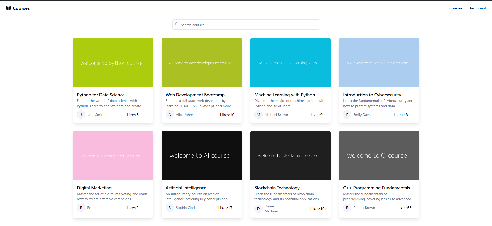
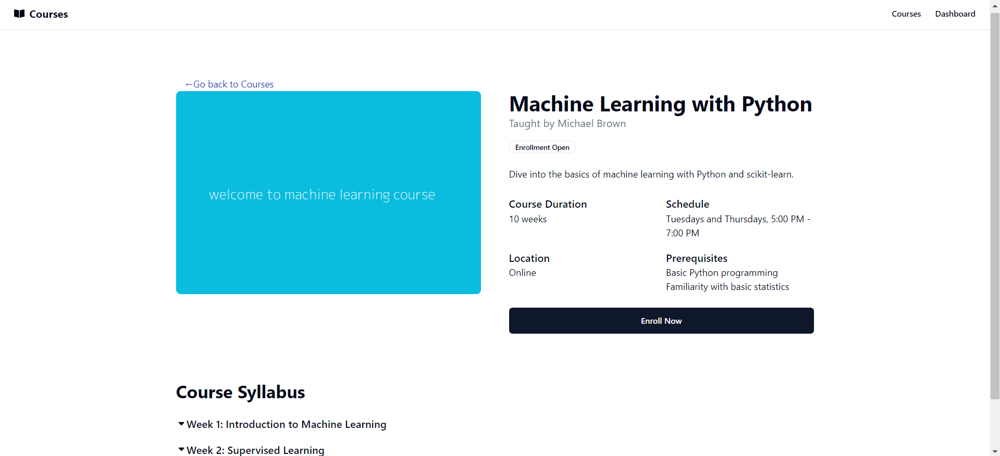
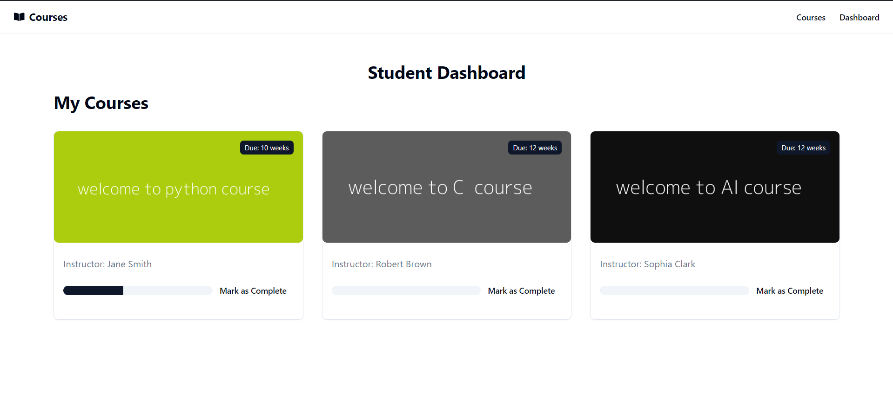

# Course Management Application

This project is a course management application that allows students to view and enroll in courses, and instructors to create and manage courses. The application consists of a frontend built with React and a backend built with Node.js and Express.Hosted on Vercel.

### [Live Link to website](https://0xcourses.vercel.app)

## Demo Video

https://github.com/yashj09/Courses/assets/118172073/d9106904-2d82-41f1-9178-580a41223f04

[Watch Demo video on Youtube](https://youtu.be/EuO9rJLA5-g)

## Screenshots

### Courselist



### CourseDetails



### StudentDashboard



## Tech Stack

### Frontend

- **React**: A JavaScript library for building user interfaces.
- **Redux**: A predictable state container for JavaScript apps.
- **Axios**: Promise-based HTTP client for the browser and Node.js.
- **Tailwind CSS**: A utility-first CSS framework for rapid UI development.
- **React-icon**: A library of popular icons for React.
- **v0.dev**: Utilize shadcn/ui library to generate UI based on simple text prompts.
  
### Backend

- **Node.js**: A JavaScript runtime built on Chrome's V8 JavaScript engine.
- **Express**: A minimal and flexible Node.js web application framework.
- **MongoDB**: A NoSQL database for storing course and user data.
- **Mongoose**: An ODM (Object Data Modeling) library for MongoDB and Node.js.
- **Vercel**: A cloud platform for static sites and Serverless Functions.

## Installation and Setup

### Prerequisites

- **Node.js**: Ensure you have Node.js installed on your machine.
- **MongoDB**: You need a MongoDB instance running locally or in the cloud (e.g., MongoDB Atlas).

### Backend Setup

1. Clone the backend repository:

```bash
git clone https://github.com/yashj09/Courses.git
cd backend
```

2. Install dependencies:

```bash
npm install
```

3. Create a `.env` file in the root directory with the following environment variables:

```env
PORT=3000
MONGO_URI=your_mongodb_connection_string or use mongodb://localhost:27017/
```

4. Start the backend server:

```bash
npm run dev
```

The backend server should now be running on `http://localhost:3000`.

### Frontend Setup

1. Clone the frontend repository:

```bash
git clone https://github.com/yashj09/Courses.git
cd frontend
```

2. Install dependencies:

```bash
npm install
```

3. Start the frontend development server:

```bash
npm run dev
```

The frontend application should now be running on `http://localhost:5173`.

### Running the Application

1. Ensure the backend server is running on `http://localhost:3000`.
2. Ensure the frontend application is running on `http://localhost:5173`.

You should now be able to access the application in your browser.

## API Endpoints

### Courses

- **GET** `/api/courses`: Get all courses.
- **POST** `/api/courses`: Create a new course .
- **GET** `/api/courses/:id`: Get a course by ID.

### Enrollment

- **POST** `api/:courseId/enroll/:studentId'`: Enroll in a course (Student only).
- **GET** `api/:studentId/courses'`: Get all courses a student is enrolled in.

Feel free to reach out if you have any questions or need further assistance!
